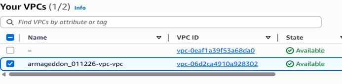
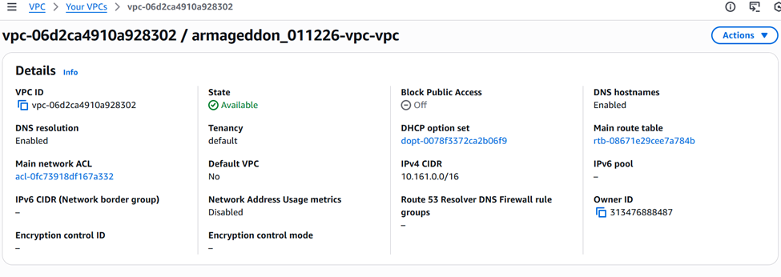
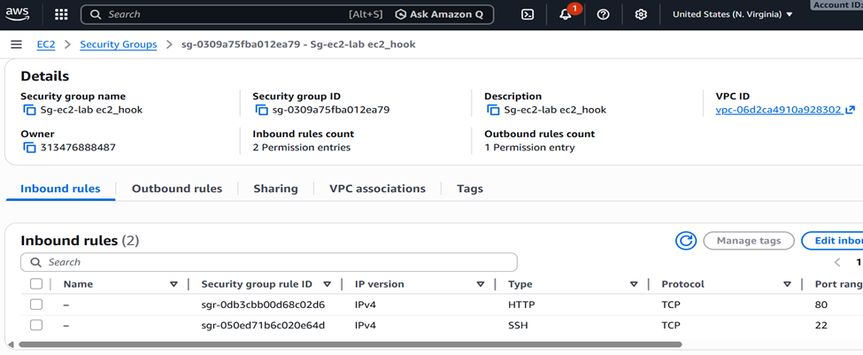
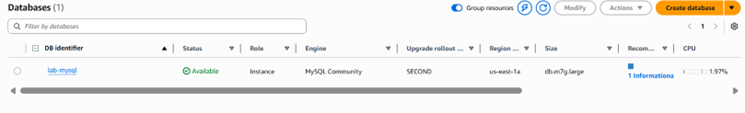
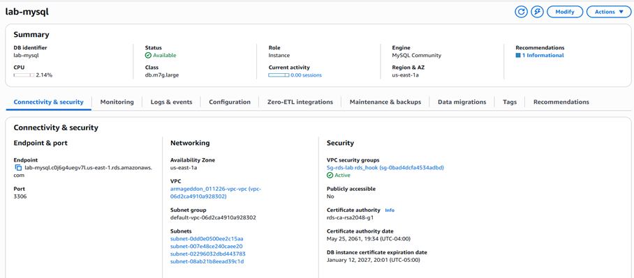
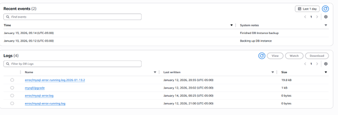
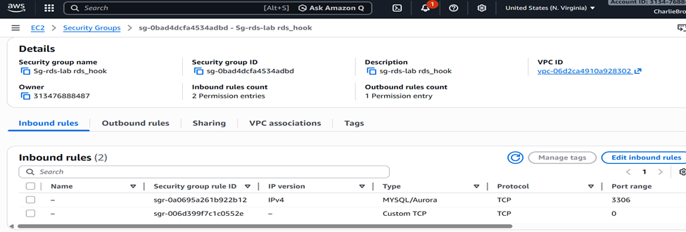
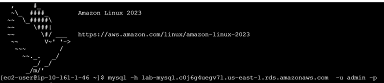
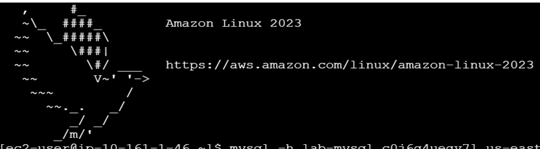
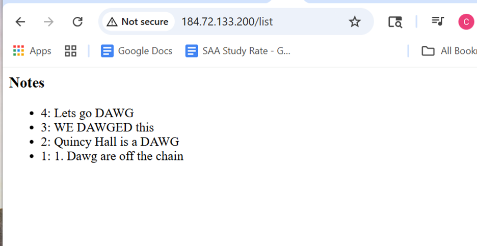

Planning 
VPC - armageddon_011226-vpc
	Create your infostructure for the lab first 
SG for EC2 - Sg-ec2-lab ec2_hook
SG for RDS - sg-rds-lab rds_hook
EC2- armageddon_011226_ec2_rds
RDS - lab-ec2-app

VPC - armageddon_011226-vpc
 
 
 

CIDRs
10.161.0.0/16
Public
10.161.1.0/24
10.161.2.0/24
Private
10.161.11.0/24
10.161.12.0/24 private

SG for EC2 - Sg-ec2-lab ec2_hook 

  

 

Pain Points
During the creation of the DB in click ops I noticed if you choose the option to allow the DB to create is on AWS Secrets Manager AWS would create its own Secret and this made the connectivity process impossible 
Some of my team members were able to connect the DB using while connecting to the EC2 and the VPC, most of the time I choose the VPC as the connection points

 

EC2- armageddon_011226_ec2_rds 

 
 

 

3) Evidence for Audits / Labs (Recommended Output)

      aws ec2 describe-security-groups --group-ids sg-0123456789abcdef0 > sg.json
      aws rds describe-db-instances --db-instance-identifier mydb01 > rds.json
3 aws secretsmanager describe-secret --secret-id my-db-secret > secret.json
4 aws ec2 describe-instances --instance-ids i-0123456789abcdef0 > instance.json
charl@CharlieZion MINGW64 ~
$ aws ec2 describe-instances --instance-ids i-053d8e26b2d18d71e > instance.json

An error occurred (InvalidInstanceID.NotFound) when calling the DescribeInstances operation: The instance ID 'i-053d8e26b2d18d71e' does not exist

5 aws iam list-attached-role-policies --role-name MyEC2Role > role-policies.json
charl@CharlieZion MINGW64 ~
$ aws iam list-attached-role-policies --role-name laba_armageddon > role-policies.json

charl@CharlieZion MINGW64 ~

