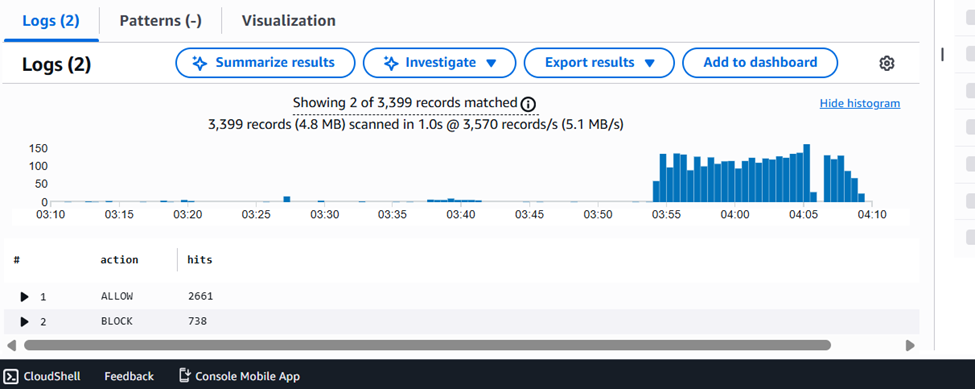
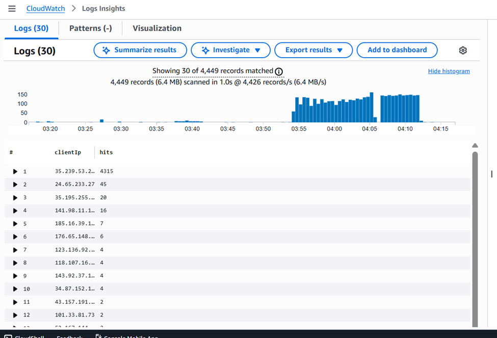
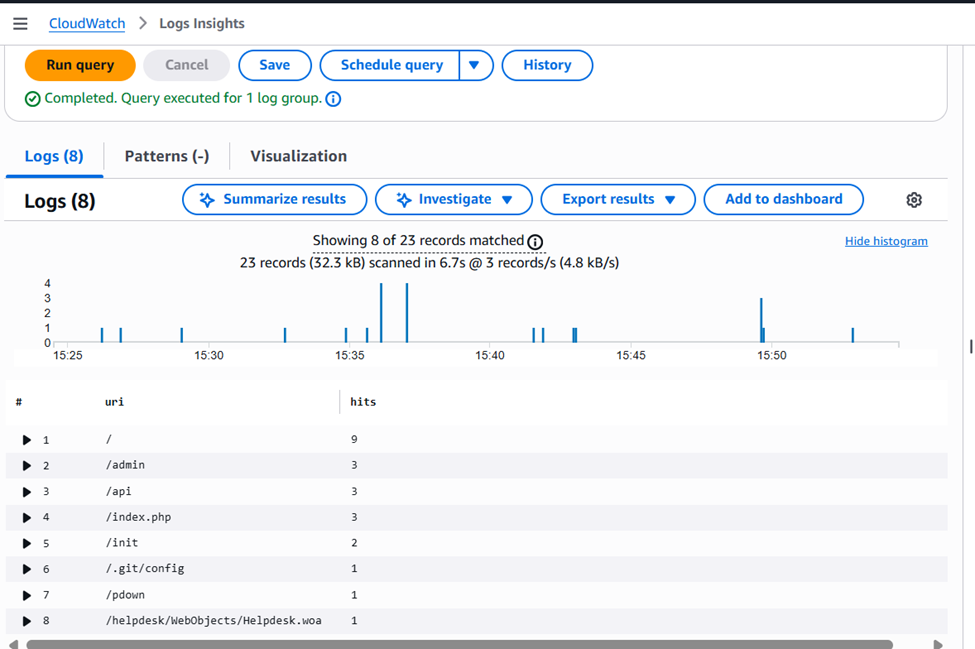
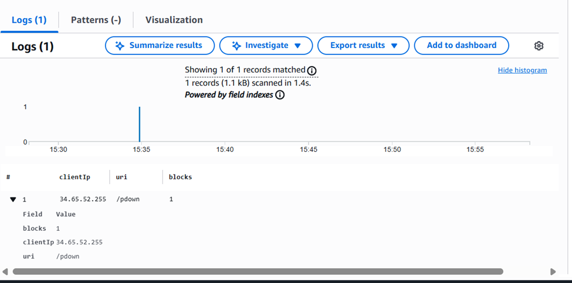
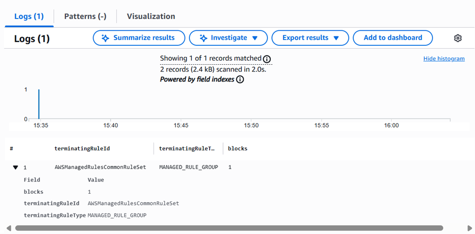
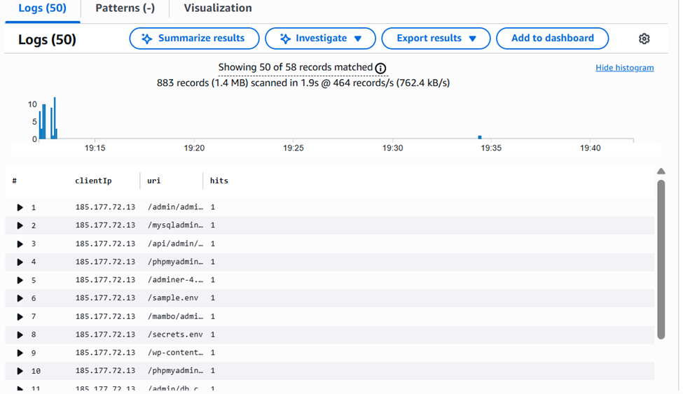
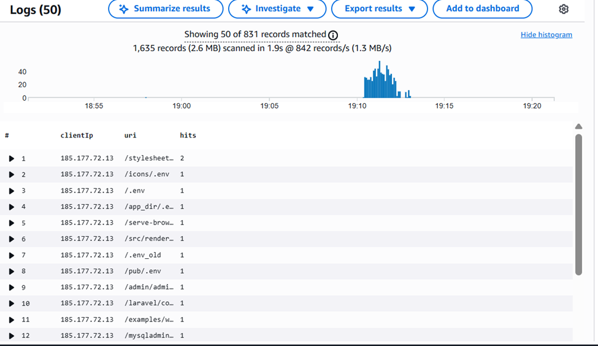

Student verification (CLI) — DNS + Logs
1) Verify apex record exists
  aws route53 list-resource-record-sets \
    --hosted-zone-id Z0512201FXFQUJ6HG6NP \
    --query "ResourceRecordSets[?Name=='cbventures.click.']"
[
    {
        "Name": "cbventures.click.",
        "Type": "A",
        "AliasTarget": {
            "HostedZoneId": "Z35SXDOTRQ7X7K",
            "DNSName": "chewbacca-alb01-853725593.us-east-1.elb.amazonaws.com.",            "EvaluateTargetHealth": true
        }
    },
    {
        "Name": "cbventures.click.",
        "Type": "NS",
        "TTL": 172800,
        "ResourceRecords": [
            {
                "Value": "ns-813.awsdns-37.net."
            },
            {
                "Value": "ns-1292.awsdns-33.org."
            },
            {
                "Value": "ns-335.awsdns-41.com."
            },
            {
                "Value": "ns-1887.awsdns-43.co.uk."
            }
        ]
    },
    {
        "Name": "cbventures.click.",
        "Type": "SOA",
        "TTL": 900,
        "ResourceRecords": [
            {
                "Value": "ns-813.awsdns-37.net. awsdns-hostmaster.amazon.com. 1 7200 900 1209600 86400"
            }
        ]
    }
]

2) Verify ALB logging is enabled
  aws elbv2 describe-load-balancers \
    --names chewbacca-alb01 \
    --query "LoadBalancers[0].LoadBalancerArn"

"arn:aws:elasticloadbalancing:us-east-1:313476888487:loadbalancer/app/chewbacca-alb01/543d529ad7a6f35f"

Then:
  aws elbv2 describe-load-balancer-attributes \
  --load-balancer-arn arn:aws:elasticloadbalancing:us-east-1:313476888487:loadbalancer/app/chewbacca-alb01/543d529ad7a6f35f

Not Working (I need to correct following error)

Changed SID to Sid    = "AllowELBWriteLogs"  "AllowELBPutObject"

data "aws_elb_service_account" "main" {} 

        Principal = {
          AWS = data.aws_elb_service_account.main.arn
        }
Error: modifying ELBv2 Load Balancer (arn:aws:elasticloadbalancing:us-east-1:313476888487:loadbalancer/app/chewbacca-alb01/543d529ad7a6f35f) attributes: operation error Elastic Load Balancing v2: ModifyLoadBalancerAttributes, https response error StatusCode: 400, RequestID: 6c52e9a3-47de-4da9-8ccd-b8f04fcb607f, InvalidConfigurationRequest: Access Denied for bucket: chewbacca-alb-logs-313476888487. Please check S3bucket permission
│
│   with aws_lb.chewbacca_alb01,
│   on bonus_b.tf line 72, in resource "aws_lb" "chewbacca_alb01":
│   72: resource "aws_lb" "chewbacca_alb01" {
{
    "Attributes": [
        {
            "Key": "access_logs.s3.enabled",
            "Value": "false"
        },
        {
            "Key": "access_logs.s3.bucket",
            "Value": ""
        },
        {
            "Key": "access_logs.s3.prefix",
            "Value": ""
        },
        {
            "Key": "health_check_logs.s3.enabled",
            "Value": "false"
        },
        {
            "Key": "health_check_logs.s3.bucket",
            "Value": ""
        },
        {
            "Key": "health_check_logs.s3.prefix",
            "Value": ""
        },
        {
            "Key": "idle_timeout.timeout_seconds",
            "Value": "60"
        },
        {
            "Key": "deletion_protection.enabled",
            "Value": "false"
        },
        {
            "Key": "routing.http2.enabled",
            "Value": "true"
        },
        {
            "Key": "routing.http.drop_invalid_header_fields.enabled",
            "Value": "false"
        },
        {
            "Key": "routing.http.xff_client_port.enabled",
            "Value": "false"
        },
        {
            "Key": "routing.http.preserve_host_header.enabled",
            "Value": "false"
        },
        {
            "Key": "routing.http.xff_header_processing.mode",
            "Value": "append"
        },
        {
            "Key": "load_balancing.cross_zone.enabled",
            "Value": "true"
        },
        {
            "Key": "routing.http.desync_mitigation_mode",
            "Value": "defensive"
        },
        {
            "Key": "client_keep_alive.seconds",
            "Value": "3600"
        },
        {
            "Key": "waf.fail_open.enabled",
            "Value": "false"
        },
        {
            "Key": "routing.http.x_amzn_tls_version_and_cipher_suite.enabled",
            "Value": "false"
        },
        {
            "Key": "zonal_shift.config.enabled",
            "Value": "false"
        },
        {
            "Key": "connection_logs.s3.enabled",
            "Value": "false"
        },
        {
            "Key": "connection_logs.s3.bucket",
            "Value": ""
        },
        {
            "Key": "connection_logs.s3.prefix",
            "Value": ""
        }
    ]
}
  Expected attributes include:
  access_logs.s3.enabled = true
  access_logs.s3.bucket = your bucket
  access_logs.s3.prefix = your prefix

3) Generate some traffic
  curl -I https://cbventures.click

HTTP/1.1 200 OK
Date: Sun, 01 Feb 2026 04:49:28 GMT
Content-Type: text/html; charset=utf-8
Content-Length: 233
Connection: keep-alive
Server: Werkzeug/3.1.5 Python/3.9.25

  curl -I https://app.chewbacca-growl.com

4) Verify logs arrived in S3 (may take a few minutes)
aws s3 ls s3://chewbacca-alb-logs-313476888487/alb-access-logs
/AWSLogs/313476888487/elasticloadbalancing/ --recursive | head

PRE alb-access-logs/
bash: /AWSLogs/313476888487/elasticloadbalancing/: No such file or directory

aws s3 ls s3://armageddon-final-alb-logs-975598471165/alb-access-logs/AWSLogs/975598471165/elasticloadbalancing/ --recursive | head

Why this matters to YOU (career-critical point)
This is incident response fuel:
  Access logs tell you:
    client IPs
    paths
    response codes
    target behavior
    latency

Combined with WAF logs/metrics and ALB 5xx alarms, you can do real triage:
  “Is it attackers, misroutes, or downstream failure?”

 4) Student verification (CLI)
A) Confirm WAF logging is enabled (authoritative)
  aws wafv2 get-logging-configuration \
    --resource-arn <WEB_ACL_ARN>

Expected: LogDestinationConfigs contains exactly one destination.

B) Generate traffic (hits + blocks)
  curl -I https://chewbacca-growl.com/
  curl -I https://app.chewbacca-growl.com/

C1) If CloudWatch Logs destination
  aws logs describe-log-streams \
  --log-group-name aws-waf-logs-<project>-webacl01 \
  --order-by LastEventTime --descending

Then pull recent events:
  aws logs filter-log-events \
  --log-group-name aws-waf-logs-<project>-webacl01 \
  --max-items 20

C2) If S3 destination
  aws s3 ls s3://aws-waf-logs-<project>-<account_id>/ --recursive | head

C3) If Firehose destination
  aws firehose describe-delivery-stream \
  --delivery-stream-name aws-waf-logs-<project>-firehose01 \
  --query "DeliveryStreamDescription.DeliveryStreamStatus"

And confirm objects land:
  aws s3 ls s3://<firehose_dest_bucket>/waf-logs/ --recursive | head

5) Why this makes incident response “real”
Now you can answer questions like:
  “Are 5xx caused by attackers or backend failure?”
  “Do we see WAF blocks spike before ALB 5xx?”
  “What paths / IPs are hammering the app?”
  “Is it one client, one ASN, one country, or broad?”
  “Did WAF mitigate, or are we failing downstream?”

This is precisely why WAF logging destinations include CloudWatch Logs (fast search) and S3/Firehose (archive/SIEM pipeline)

 Lab 1C-Bonus-F: Logs Insights Query Pack
Variables students fill in (for the runbook)
  WAF log group: aws-waf-logs-<project>-webacl01

  App log group: /aws/ec2/<project>-rds-app

Requirements: Set the time range to Last 15 minutes (or match incident window).

A) WAF Queries (CloudWatch Logs Insights)
A1) “What’s happening right now?” (Top actions: ALLOW/BLOCK)
  fields @timestamp, action
  | stats count() as hits by action
  | sort hits desc

A2) Top client IPs (who is hitting us the most?)
  fields @timestamp, httpRequest.clientIp as clientIp
| stats count() as hits by clientIp
| sort hits desc
| limit 25

A3) Top requested URIs (what are they trying to reach?)
  fields @timestamp, httpRequest.uri as uri
| stats count() as hits by uri
| sort hits desc
| limit 25

A4) Blocked requests only (who/what is being blocked?)
  fields @timestamp, action, httpRequest.clientIp as clientIp, httpRequest.uri as uri
| filter action = "BLOCK"
| stats count() as blocks by clientIp, uri
| sort blocks desc
| limit 25

A5) Which WAF rule is doing the blocking?
  fields @timestamp, action, terminatingRuleId, terminatingRuleType
| filter action = "BLOCK"
| stats count() as blocks by terminatingRuleId, terminatingRuleType
| sort blocks desc
| limit 25

A6) Rate of blocks over time (did it spike?)
  fields @timestamp, httpRequest.clientIp as clientIp, httpRequest.uri as uri
| filter uri like /wp-login|xmlrpc|\.env|admin|phpmyadmin|\.git|\/login/i
| stats count() as hits by clientIp, uri
| sort hits desc
| limit 50

#edit
fields @timestamp, httpRequest.clientIp as clientIp, httpRequest.uri as uri | filter uri =~ /wp-login|xmlrpc|\.env|admin|phpmyadmin|\.git|login/ | stats count() as hits by clientIp, uri | sort hits desc | limit 50

A7) Suspicious scanners (common patterns: admin paths, wp-login, etc.)
  fields @timestamp, httpRequest.clientIp as clientIp, httpRequest.uri as uri
| filter uri like /wp-login|xmlrpc|\.env|admin|phpmyadmin|\.git|\/login/i
| stats count() as hits by clientIp, uri
| sort hits desc
| limit 50

A8) Country/geo (if present in your WAF logs)
Some WAF log formats include httpRequest.country. If yours does:
  fields @timestamp, httpRequest.country as country
| stats count() as hits by country
| sort hits desc
| limit 25

B) App Queries (EC2 app log group)
These assume your app logs include meaningful strings like ERROR, DBConnectionErrors, timeout, etc
(You should enforce this.)
 Lab 1C-Bonus-F: Logs Insights Query Pack

Variables students fill in (for the runbook)
  WAF log group: aws-waf-logs-<project>-webacl01
  App log group: /aws/ec2/chewbacca-rds-app

Requirements: Set the time range to Last 15 minutes (or match incident window).

A) WAF Queries (CloudWatch Logs Insights)
A1) “What’s happening right now?” (Top actions: ALLOW/BLOCK)
  fields @timestamp, action
  | stats count() as hits by action
  | sort hits desc

A2) Top client IPs (who is hitting us the most?)
  fields @timestamp, httpRequest.clientIp as clientIp
| stats count() as hits by clientIp
| sort hits desc
| limit 25

A3) Top requested URIs (what are they trying to reach?)
  fields @timestamp, httpRequest.uri as uri
| stats count() as hits by uri
| sort hits desc
| limit 25

A4) Blocked requests only (who/what is being blocked?)
  fields @timestamp, action, httpRequest.clientIp as clientIp, httpRequest.uri as uri
| filter action = "BLOCK"
| stats count() as blocks by clientIp, uri
| sort blocks desc
| limit 25

A5) Which WAF rule is doing the blocking?
  fields @timestamp, action, terminatingRuleId, terminatingRuleType
| filter action = "BLOCK"
| stats count() as blocks by terminatingRuleId, terminatingRuleType
| sort blocks desc
| limit 25

A6) Rate of blocks over time (did it spike?)
  fields @timestamp, httpRequest.clientIp as clientIp, httpRequest.uri as uri
| filter uri like /wp-login|xmlrpc|\.env|admin|phpmyadmin|\.git|\/login/i
| stats count() as hits by clientIp, uri
| sort hits desc
| limit 50

#edit
fields @timestamp, httpRequest.clientIp as clientIp, httpRequest.uri as uri | filter uri =~ /wp-login|xmlrpc|\.env|admin|phpmyadmin|\.git|login/ | stats count() as hits by clientIp, uri | sort hits desc | limit 50

A7) Suspicious scanners (common patterns: admin paths, wp-login, etc.)
  fields @timestamp, httpRequest.clientIp as clientIp, httpRequest.uri as uri
| filter uri like /wp-login|xmlrpc|\.env|admin|phpmyadmin|\.git|\/login/i
| stats count() as hits by clientIp, uri
| sort hits desc
| limit 50

A8) Country/geo (if present in your WAF logs)
Some WAF log formats include httpRequest.country. If yours does:
  fields @timestamp, httpRequest.country as country
| stats count() as hits by country
| sort hits desc
| limit 25

B) App Queries (EC2 app log group)
These assume your app logs include meaningful strings like ERROR, DBConnectionErrors, timeout, etc
(You should enforce this.)

B1) Count errors over time (this should line up with the alarm window)
  fields @timestamp, @message
| filter @message like /ERROR|Exception|Traceback|DB|timeout|refused/i
| stats count() as errors by bin(1m)
| sort bin(1m) asc

B2) Show the most recent DB failures (triage view)
  fields @timestamp, @message
| filter @message like /DB|mysql|timeout|refused|Access denied|could not connect/i
| sort @timestamp desc
| limit 50

B3) “Is it creds or network?” classifier hints
  Credentials drift often shows: Access denied, authentication failures
  Network/SecurityGroup often shows: timeout, refused, “no route”, hang
  fields @timestamp, @message
| filter @message like /Access denied|authentication failed|timeout|refused|no route|could not connect/i
| stats count() as hits by
  case(
    @message like /Access denied|authentication failed/i, "Creds/Auth",
    @message like /timeout|no route/i, "Network/Route",
    @message like /refused/i, "Port/SG/ServiceRefused",
    "Other"
  )
| sort hits desc

B4) Extract structured fields (Requires log JSON)
If you log JSON like: {"level":"ERROR","event":"db_connect_fail","reason":"timeout"}:
  fields @timestamp, level, event, reason
| filter level="ERROR"
| stats count() as n by event, reason
| sort n desc

(Thou Shalt need to emit JSON logs for this one.)

C) Correlation “Enterprise-style” mini-workflow (Runbook Section)
Add this to the incident runbook:

Step 1 — Confirm signal timing
  CloudWatch alarm time window: last 5–15 minutes
  Run App B1 to see error spike time bins

Step 2 — Decide: Attack vs Backend Failure
  Run WAF A1 + A6:
    If BLOCK spikes align with incident time → likely external pressure/scanning
    If WAF is quiet but app errors spike → likely backend (RDS/SG/creds)

Step 3 — If backend failure suspected
  Run App B2 and classify:
    Access denied → secrets drift / wrong password
    timeout → SG/routing/RDS down
  Then retrieve known-good values:
    Parameter Store /lab/db/*
    Secrets Manager /<prefix>/rds/mysql

Step 4 — Verify recovery
  App errors return to baseline (B1)
  WAF blocks stabilize (A6)
  Alarm returns to OK
  curl https://app.chewbacca-growl.com/list works
 Lab 1C-Bonus-F: Logs Insights Query Pack
Variables students fill in (for the runbook)
  WAF log group: aws-waf-logs-<project>-webacl01
  App log group: /aws/ec2/<project>-rds-app

Requirements: Set the time range to Last 15 minutes (or match incident window).

A) WAF Queries (CloudWatch Logs Insights)
A1) “What’s happening right now?” (Top actions: ALLOW/BLOCK)
  fields @timestamp, action
  | stats count() as hits by action
  | sort hits desc

 

A2) Top client IPs (who is hitting us the most?)
  fields @timestamp, httpRequest.clientIp as clientIp
| stats count() as hits by clientIp
| sort hits desc
| limit 25

 

A3) Top requested URIs (what are they trying to reach?)
  fields @timestamp, httpRequest.uri as uri
| stats count() as hits by uri
| sort hits desc
| limit 25

 

A4) Blocked requests only (who/what is being blocked?)
  fields @timestamp, action, httpRequest.clientIp as clientIp, httpRequest.uri as uri
| filter action = "BLOCK"
| stats count() as blocks by clientIp, uri
| sort blocks desc
| limit 25

 

A5) Which WAF rule is doing the blocking?
  fields @timestamp, action, terminatingRuleId, terminatingRuleType
| filter action = "BLOCK"
| stats count() as blocks by terminatingRuleId, terminatingRuleType
| sort blocks desc
| limit 25

 

A6) Rate of blocks over time (did it spike?)
  fields @timestamp, httpRequest.clientIp as clientIp, httpRequest.uri as uri
| filter uri like /wp-login|xmlrpc|\.env|admin|phpmyadmin|\.git|\/login/i
| stats count() as hits by clientIp, uri
| sort hits desc
| limit 50

#edit
fields @timestamp, httpRequest.clientIp as clientIp, httpRequest.uri as uri | filter uri =~ /wp-login|xmlrpc|\.env|admin|phpmyadmin|\.git|login/ | stats count() as hits by clientIp, uri | sort hits desc | limit 50

 

A7) Suspicious scanners (common patterns: admin paths, wp-login, etc.)
  fields @timestamp, httpRequest.clientIp as clientIp, httpRequest.uri as uri
| filter uri like /wp-login|xmlrpc|\.env|admin|phpmyadmin|\.git|\/login/i
| stats count() as hits by clientIp, uri
| sort hits desc
| limit 50

 

A8) Country/geo (if present in your WAF logs)
Some WAF log formats include httpRequest.country. If yours does:
  fields @timestamp, httpRequest.country as country
| stats count() as hits by country
| sort hits desc
| limit 25

 

B) App Queries (EC2 app log group)
These assume your app logs include meaningful strings like ERROR, DBConnectionErrors, timeout, etc
(You should enforce this.)

B1) Count errors over time (this should line up with the alarm window)
  fields @timestamp, @message
| filter @message like /ERROR|Exception|Traceback|DB|timeout|refused/i
| stats count() as errors by bin(1m)
| sort bin(1m) asc

B2) Show the most recent DB failures (triage view)
  fields @timestamp, @message
| filter @message like /DB|mysql|timeout|refused|Access denied|could not connect/i
| sort @timestamp desc
| limit 50

B3) “Is it creds or network?” classifier hints
  Credentials drift often shows: Access denied, authentication failures
  Network/SecurityGroup often shows: timeout, refused, “no route”, hang
  fields @timestamp, @message
| filter @message like /Access denied|authentication failed|timeout|refused|no route|could not connect/i
| stats count() as hits by
  case(
    @message like /Access denied|authentication failed/i, "Creds/Auth",
    @message like /timeout|no route/i, "Network/Route",
    @message like /refused/i, "Port/SG/ServiceRefused",
    "Other"
  )
| sort hits desc

B4) Extract structured fields (Requires log JSON)
If you log JSON like: {"level":"ERROR","event":"db_connect_fail","reason":"timeout"}:
  fields @timestamp, level, event, reason
| filter level="ERROR"
| stats count() as n by event, reason
| sort n desc

(Thou Shalt need to emit JSON logs for this one.)

C) Correlation “Enterprise-style” mini-workflow (Runbook Section)
Add this to the incident runbook:

Step 1 — Confirm signal timing
  CloudWatch alarm time window: last 5–15 minutes
  Run App B1 to see error spike time bins

Step 2 — Decide: Attack vs Backend Failure
  Run WAF A1 + A6:
    If BLOCK spikes align with incident time → likely external pressure/scanning
    If WAF is quiet but app errors spike → likely backend (RDS/SG/creds)

Step 3 — If backend failure suspected
  Run App B2 and classify:
    Access denied → secrets drift / wrong password
    timeout → SG/routing/RDS down
  Then retrieve known-good values:
    Parameter Store /lab/db/*
    Secrets Manager /<prefix>/rds/mysql

Step 4 — Verify recovery
  App errors return to baseline (B1)
  WAF blocks stabilize (A6)
  Alarm returns to OK
  curl https://app.chewbacca-growl.com/list works
